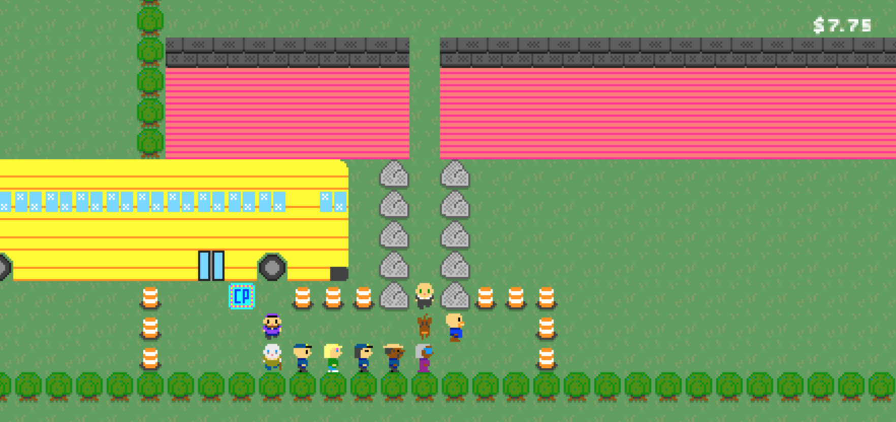

@author: rgbz
@title: Conga Quest & Conga Studio

# Conga Quest & Conga Studio
It's been a few years now since I participated in the [Ludum Dare](https://ldjam.com/) game jam where I made [Conga Quest](http://squeakytinkerings.com/). Since that time I've been trying to make a larger game and engine based on the premise.

## What's Conga Quest?
Conga Quest is a short game I made for a [Ludum Dare 40](https://ldjam.com/events/ludum-dare/40) where the theme was "the more you have, the worse it gets".

When the theme was first revealed my mind immediately went to [Snake](https://en.wikipedia.org/wiki/Snake_(video_game_genre)), a game I used to play on my old Nokia cell phone.

In Snake, you play as the snake who has to eat little bits of food that appear on the screen. The snake is always moving at a constant velocity in the direction it's currently facing. As the player you get to change what direction the snake is heading in. The trouble is, you lose if the snake either runs into the edge of the screen or its own body. Every time you eat a bit of food the snake gets longer and moves faster.

Personally I hated Snake. It wasn't a very interesting game and it was difficult to get good at. Getting good at it never appealed to me. I grew up as a fan of adventure games like the Zelda series, King's Quest and Space Quest.

I thought it might be fun to mix the genres, to create an adventure game around snake.

The basic idea was that you'd start as a single player, but by completing small quests you'd convince other characters to follow you creating what looked like a conga line. Unlike Snake you could control your speed (since I never liked that aspect) and you'd have to traverse mazes that became more and more difficult as your line length increased.

I built the game within the weekend and submitted it to the game jam. I don't think many people played it. I didn't realize that you had to play and review a lot of other people's games in order for your game to be surfaced. However I really liked the end result and had ideas on how to extend it into a larger game.

## The Road To A Bigger Game
This game jam occurred at the end of 2017. Earlier that year I'd put several hours into, and beaten, [The Legend of Zelda: Breath of the Wild](https://en.wikipedia.org/wiki/The_Legend_of_Zelda:_Breath_of_the_Wild). I really enjoyed the game and the brave departures it had made from the rest of the Zelda series.

I'd seen and read a number of things on how Breath of the Wild was made, including a [session](https://www.youtube.com/watch?v=QyMsF31NdNc) at 2017's Game Developer's Conference (GDC) where developers from Nintendo discussed how they approached developing the game.

What really stuck with me from that presentation was how the roughly 300-person development team collaborated by making a number of tools to build the game from inside the game. They had a system where you could run through the world and add notes about parts of the landscape that were boring and would be good to embellish.

Two years prior, [Super Mario Maker](https://en.wikipedia.org/wiki/Super_Mario_Maker) had come out. This was a [WYSIWYG](https://en.wikipedia.org/wiki/WYSIWYG) editor for making Mario levels. It was a lot of fun and included a lot of neat tools for developing the game.

Even prior to that, Minecraft blurred the lines between game and editor.

With all these inspirations, I wanted to make some tools to make it easier to further develop Conga Quest. The original game was a bit of a hack that leveraged JSON-based [Sketch](https://www.sketch.com/) files I'd used to draw the worlds. It let me develop quickly, but the approach was cumbersome.

So for the larger game, I set out to make "Conga Studio", a WYSIWYG editor for making a more ambitious Conga Quest.

## Distilling the Conga Recipe
In order to make an engine, you need to know the boundaries of what you'll be able to do in the game. I didn't want to stray far from the original game, so I listed what you'd be able to do (which wasn't much):
- Walk around
- Pick up items
- Give away items
- View your inventory
- Get characters to join your line
- Have characters leave your line
- Talk to characters with branching dialogue

The plan was for both the game and the editor to be web applications. I started building Conga Studio and used it to make a fun little level. The editor let you:
- Create characters
- Add sprites for characters and backgrounds
- Define dialogue trees
- Create items
- Drawing worlds
- Add "events" for things like triggering dialogue, picking up items, unlocking doors or teleporting to different parts of the world

The editor was easy to use, but not so easy to learn. I showed my friend Kris how to use it one weekend and we each spent some time making levels. My vision was to have a game made up of a bunch of different random levels that we could later connect via some narrative.

## What's next?
Life happened and I haven't made much progress on Conga Quest or Conga Studio. In January of this year I spent the month learning the Rust programming language for fun and decided to port the game to Rust. I started on this, but got distracted.

Now that I'm learning Swift and iOS development. The current plan is to port both to iOS and continue work on them for Apple devices.