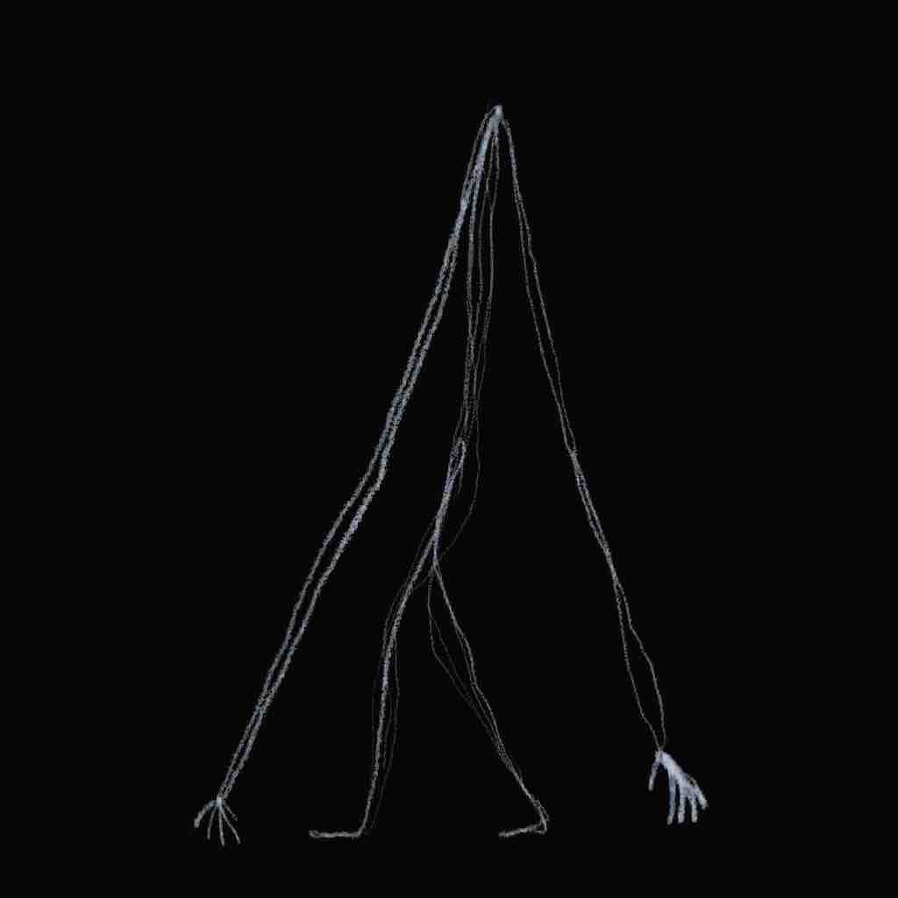
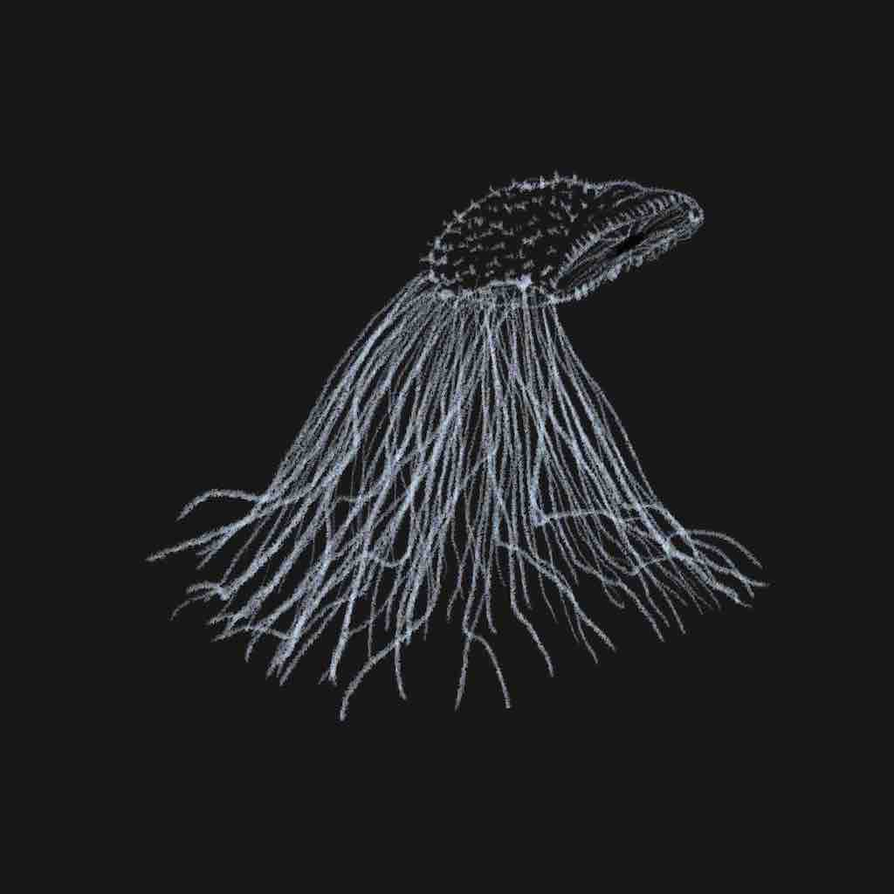
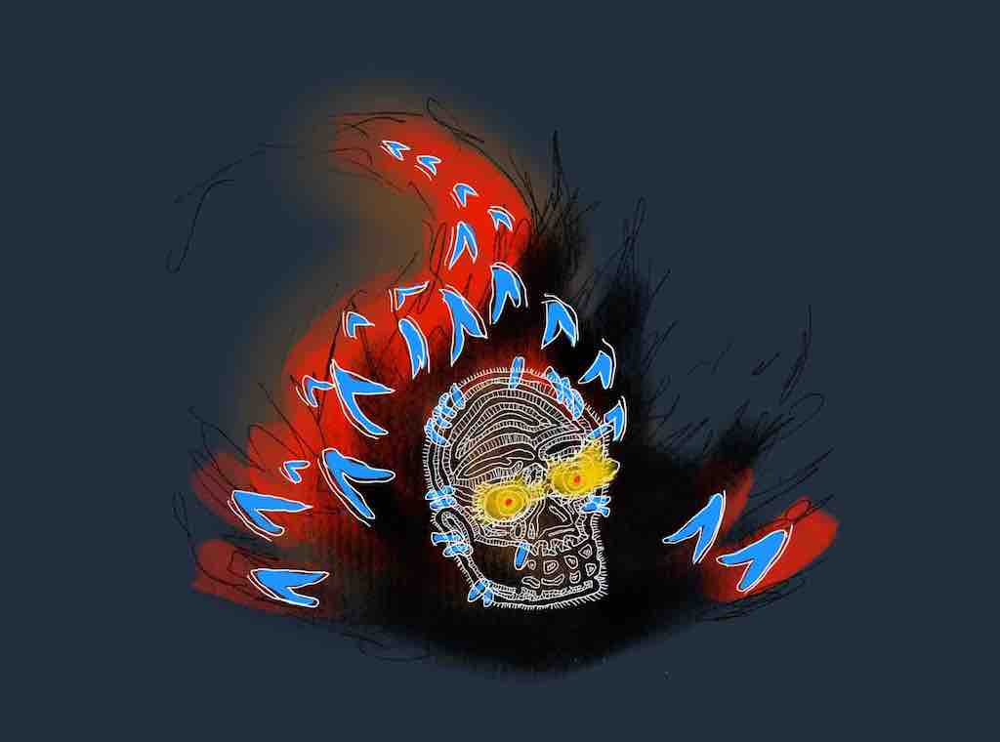
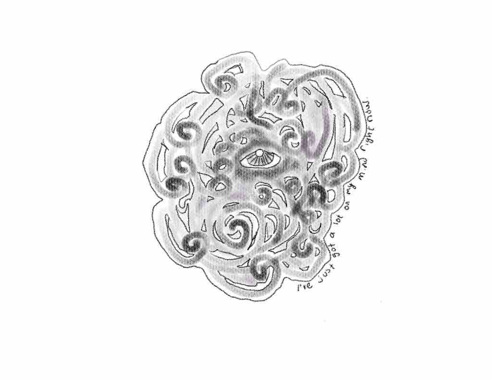

@title: Drawing Corner

# Drawing Corner
Every magazine needs corners! Here's this issue's second corner, the **Drawing Corner**!

## Creepy Stuff!
Halloween was yesterday, but who cares. In this issue I have some creepy stuff.

As a child, I was a big fan of the book [Scary Stories To Tell In The Dark](https://en.wikipedia.org/wiki/Scary_Stories_to_Tell_in_the_Dark). I really liked the creepy art style.

For this issue, I made some creepy looking drawings that aren't necessarily in the same style, but have a similar vibe.

### Lanky Guy
This guy is really tall and he may, or may not, have a head.

### Hairy Thing
This is kind of a mix between the sandworms from the new Dune movie and a bunch of cilia-like hair.

### Stylish Skull
This is currently the wallpaper for my computer and iPad. It's a knock off of the [Bubble](https://zelda.gamepedia.com/Bubble) enemies from the Zelda series.

### Foggy
All through the covid situation I've been feeling more anxious than usual. This is a representation of that.

