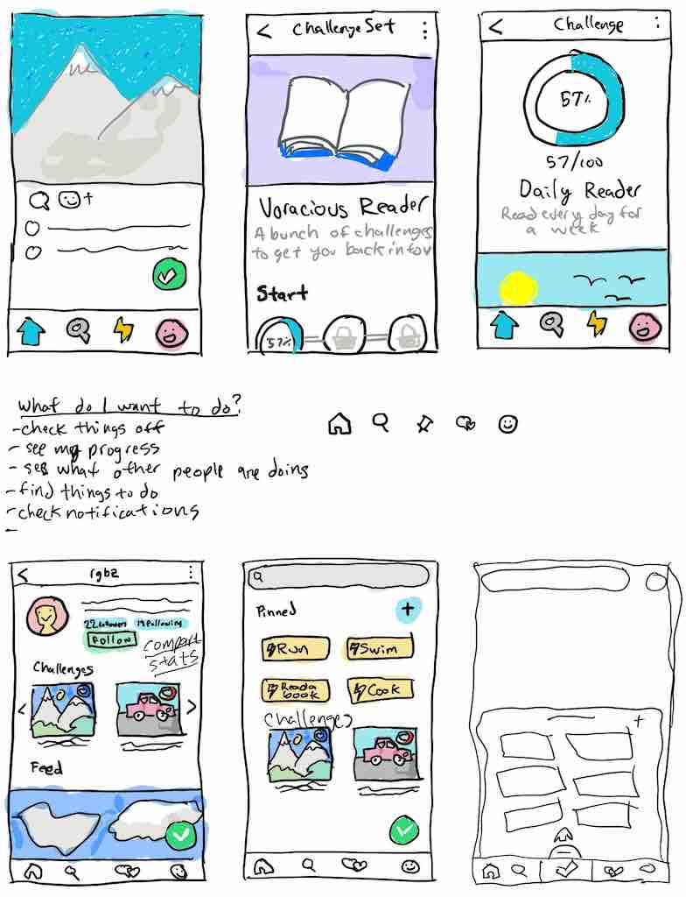

@author: rgbz
@title: What's Next for Checkverse

# What's Next for Checkverse

Maybe nothing.

Maybe something else.

## What's Checkverse?
[Checkverse](https://checkverse.com) is the app I made when I quit my job and moved to NYC to try to start my own business.

The idea was to have an app that let you make your own games out of real life. It came to me when I lived in Albany. The city had placed a number of decorated pianos in different locations. I thought it'd be cool if there was an app where you could "check off" playing at each piano and prove it with a photo. The original idea was to call the app "Goalbum" as it would act as an album of goals.

A number of fits and starts later including a partnership that fell apart, my options at work fully vested so my girlfriend (at the time, now wife) and I decided to do something new with our lives. We moved to Brooklyn and I formally got to work making an app that matched the original vision I had: a simple tool for creating and completing challenges in the real world.

"Goalbum" was hard to say and not very appealing word so I came up with a number of different names, eventually landing on "Checkverse". "Check" because you'd check things off and "verse" because it was going to be a universe full of things to check off.

I made (what I thought) was a neat logo of a checkmark inside a circle. The checkmark made the negative space in the circle into a "C" and the mark itself was a "V".

The initial version of the app let you make things to check off called "objectives". You'd check off objectives by posting a photo to act as proof of you accomplishing the objective. You could follow other people using a mechanism similar to Twitter or Instagram. Anything you checked off would be shared to the feeds of the folks who followed you. Your followers could then check off what you just did and post their own photos. Objectives were like a reverse hash tag.

The app also included the ability to create and complete "missions" which were collections of objectives around a theme. Other people could "take on" the missions you created and compete with you to complete them.

A lot of people from Albany knew I'd left my well paying job to do this. So a number of them created an account when I launched. For a few weeks there was a good amount of participation. Folks checked things off, created missions and took on each other's missions. It was pretty cool, but also stressful. People used the app, but weren't sharing it with others.

I'd read how Snapchat took awhile to really pick up speed and only did so after the founder's cousin started using it in high school. I was hoping someone would eventually see the potential for Checkverse and do the same thing.

I had ideas about businesses making missions for their customers to complete, people using Checkverse for personal goals and much more. However, none of that came to pass and eventually the usage began to dwindle.

Eventually I was asked to become a technical cofounder in another business and stopped making updates to Checkverse. A handful of people still use it today, but the flame has all but gone out.

## Is Checkverse Over?
The itch hasn't gone away. Maybe I'm crazy, but I still feel like there's this gaping hole of an opportunity for democratizing the making of games out of the real world.

Twitch started as a way for people to broadcast video online called Justin.tv. It wasn't till 4 years later that it was rebranded as Twitch and refocused on streaming video games.

Why did they do that? The folks at Justin.tv recognized that some of the most popular streams were streams of people just playing video games. They redesigned their site to make it easy to find people playing the games you wanted to see. Twitch does more than that now, but video game streaming was a key subset that got them to become a household name.

I think the same thing can happen for Checkverse. I think the tool was too broad. You'd think a broad, flexible tool would be ideal, but it's not. Most tools take off due to some "killer application". Twitch's killer application was video game streaming. For personal computers, it was spreadsheet programs that made it easier for businesses to record and track data. So the question is, what are the killer applications for Checkverse?

## Potential Killer Applications
Checkverse had some common usage patterns:
- Personal goal setting
- Sharing media consumption & reviews
- Collecting experiences

### Personal Goal Setting
This application makes a lot of sense. The missions and objectives lent themselves very well to a shared accountability system where people knew what your goals were and could watch you accomplish them in real time.

In 2016 I ran a half marathon by completing training missions made by my friend Allison. Every week she made a new training schedule mission. I completed them with her despite the two of us living hundreds of miles apart. We both registered for and completed separate half marathons after the training. I never would have done this without Checkverse. It felt like Allison and I were in it together and I didn't want to let her down by missing training. That alone is a major accomplishment.

### Sharing Media Consumption & Reviews
A very popular use of Checkverse is sharing the movies, TV shows and books people have read. There are a lot of other communities for this already and its something Checkverse doesn't necessarily make much easier, but it's worth recognizing nonetheless.

### Collecting Experiences
A big reason I made Checkverse in the first place was to motivate myself to try new things. A lot of people created missions to try out different beers, restaurants and movies. For awhile I'd use Checkverse to track progress toward watching the acadamey award nominated films.

## Back to the Drawing Board
After reflecting on these use cases, it seemed like Personal Goal Setting would be the best candidate to focus on.

The social accountability that Checkverse afforded is really useful and continues to motivate the folks still using the app.

So how can the Checkverse concept be better tailored for this use case?

One thing is adding additional ways to measure progress. Currently Checkverse is pretty binary. Either you accomplished an objective or you didn't. If your goal is to run 30 miles every month, there's no great way to track your progress toward that. You'd either have to break it into a number of sub goals that you check off one by one, or just wait till you're all done and check off "Run 30 miles in a month".

My friend Ron suggested having a way to track that more granular, arbitrarily-sized progress toward a goal. If you need to run 30 miles in a month, why not make it easy to track that? Maybe you skip a few days and run 8 miles on the weekends. How you get to the goal shouldn't matter as long as you 1) see your progress toward it and 2) accomplish it!

After a lot of thinking and doodling, I came up with a new approach: metrics, actions and challenges.

### Metrics
Metrics are a way to measure things with real numbers. Things like distances, time spent, quantities, etc... The app will come with a number of pre-defined metrics, but folks will be able to create their own.

### Actions
Actions are tasks that include metrics. For instance "Run" would be an action with associated metrics like "distance" and "duration". Actions can inherit from each other. For instance the "Run" action would count as "Exercise" action.

With actions set up this way, the data will be available to easily answer questions like "how many miles did I run last year?" or "how many movies did I see?"

### Challenges
Challenges are goals made up of actions and metrics. For instance, you could make a challenge like "Exercise for 20 total hours within a month". Any action you complete that counts as exercise would contribute to your progress on this challenge. This frees you up to design cool things like training programs or syllabi.

## That's All Folks!
So there you have it. That's what I think the future holds for Checkverse. I'm working on a prototype now. It's unlikely that it'll be called "Checkverse" in its new incarnation. If you're interested in beta testing, let me know on Twitter. I'm @rgbz.